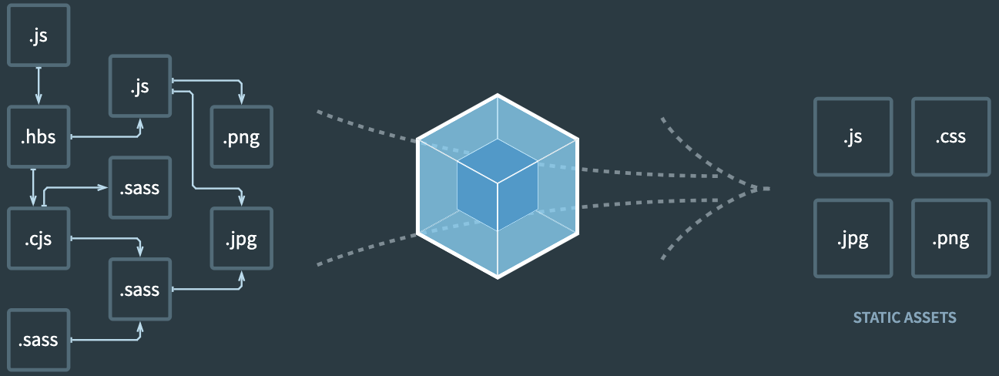

# Webpack 설정 및 내용 정리

webpack 학습을 위해 inflearn 강의 수강 후 정리

## 0. 개발환경 설정

### 0.1 npm 

Javascript 개발환경을 위한 패키지 매니저 입니다. npm을 패키지를 관리할때는 3개의 형태로 (예시 ^10.12.1) 버전을 표현하며 각각의 의미는 아래와 같습니다.

- Major Version : 기존 버전과 호환되지 않음
- Minor Version : 기존버전과 호환되면서 기능 일부 추가
- Patch Version : 기전버전과 호환되면서 버그를 수정한 경우


## 1. Webpack의 출현배경 


### 1.1 javascript의 한계
webpack은 간단하게 말해 javascript의 발전에 따라 javascript가 가지는 한계를 극복하기 위해 출현되었습니다.

- 전역 scope 또는 변수가 오염된다.
- 함수에 값을 할당 할 수 있다.

js의 고유 특성으로 개발 유연성을 가져다 주지만, 반대로 유지보수의 어려움을 야기하기도 합니다.


```html
<body>
    <script type="text/javascript">
        function sum(a, b) {
            return a + b;
        }
    </script>
    <script type="text/javascript">
        console.log(sum(1, 2)); // => 3
    </script>
    <script type="text/javascript">
        sum = 1;
        console.log(sum); // => 1
    </script>
    <script>
        console.log(sum(1, 2)); // => error : sum is not function
    </script>
</body>
```

함수 선언시 전역객체에 선언되기 때문에 하위 어느 곳에서든 호출이 가능합니다. 약속되지 않은 상태에서 `sum`을 조작하게 되면 런타임 에러가 발생할 수 있습니다.
<br><br>

### 1.1 즉시 실행 함수 IIFE(Immediately Invoked Function Expression)
과거의 web 개발은 이와 같은 문제를 처리하기 위해 독립적인 scope를 갖는 즉시 실행 함수를 사용했습니다.

```javascript
var math = math || {};

(function () {
    function sum(a, b) {
        return a + b;
    }
     
    math.sum = sum;
})();
```

`math` 객체를 최초 정의 후 해당 객체아래 즉시 실행함수를 정의하여 `sum` 함수는 고유 scope 영역을 가질수 있게 되었습니다.
<br><br>

### 1.2 모듈의 출현
각각의 커뮤니티에서 독자적인 방법을 사용하였으나, [`ES2015`](https://262.ecma-international.org/6.0/#sec-scripts) 에서 표준 모듈 시스템을 정의 했습니다.

```javascript
// math.js
export function sum(a, b) {return a+b};

// app.js
import sum from 'math.js'

// html
<script type="module" src="math.js">
<script type="module" src="app.js">
```

그러나 js를 사용하는 현대의 모든 브라우저(explorer) 또는 framework(node.js-express) 등이 모듈을 지원하진 않습니다. 이러한 문제 때문에 현재는 webpack + bable 의 조합으로 이를 해결합니다.

## 2. Webpack 이란?

### 2.1 [Webpack](https://webpack.js.org/)


webpack은 모듈로 연견될 js파일들을 `하나의` 파일 즉 `bundle` 을 생성합니다.

```bash
$ npm install -D webpack

$ npm install -D webpack-cli // terminal 명령어로 설정이 가능하게 해준다.
```

### 2.2 Entry/Output

webpack 설정 시 3가지 옵션을 필수로 지정합니다.
- --mode : 개발환경에 따라 옵션을 설정할 수 있습니다.
    - ["development", "production", "none"]
- entry : 모둘의 시작점. 
    - 일반적으로 `app.js`, `index.js` 등으로 표현합니다.
- output : bundle 결과물을 저장하는 경로를 지정합니다. 
    - 일반적으로 `dist` 등으로 표현합니다.

**webpack 명령어 예시**

```bash
$ webpack --mode development --entry ./src/app.js --output dist/app.
```

일반적으로는 config 파일을 이용합니다.
```javascript
// webpack.config.js
module:exports = {
    mode: 'development',
    entry: {
        main: './src/app.js'
    },
    output: {
        path: path.resolve('./dist'),
        filename: '[name].js'
    }
}
```

이와 같은 식으로 생성된 파일은 vanila.js로 생성되며 모든 브라우저에서 사용이 가능합니다.

```html
<!-- <script type="module" src="math.js"> -->
<script src="app.js"> 
```

### 2.3 Loader

webpack은 모든 리소스들을 모듈로 바라봅니다. css, image, font등을 js 로 변환하여 import를 이용하면 js 코드 안으로 가져올 수 있습니다. 이것이 가능한 이유는 `loader` 덕분입니다. 

loader 는 webpack.config.js 파일에 정의합니다. custom하게 작성할 수 있으나, 일반적으로 작성된 로더를 다운받아 사용합니다.

```javascript
module: {
    rules: [
        {
            test: /\.css$/,
            use: [
                {
                    loader: 'style-loader'
                },
                {
                    loader: 'css-loader',
                    options: 
                    {
                        module: true
                    }
                },
                {
                    loader: 'file-loader'
                }
            ]
        }
    ]
}
```


### 2.4 Plugin

webpack이 번들링한 결과물의 후처리를 하는 역할을 담당합니다. 생성된 js파일을 난독화 하거나 특정 텍스트를 변경/추가 등의 작업을 가능케 합니다. 자주사용하는 plugin으로는 `HtmlWebpackPlugin`, `copy-webpack-plugin` 등이 있습니다.

```javascript
module.exports = {
  entry: 'index.js',
  output: {
    path: path.resolve(__dirname, './dist'),
    filename: 'index_bundle.js',
  },
  plugins: [new HtmlWebpackPlugin()],
};
```

## 3. Babel

Webpack을 사용해서 browser에서 사용시 모듈로 사용하는 방법은 해결됐지만 아직 추가적인 문제가 남아있습니다. 바로 브라우저 호환성 문제입니다. 브라우저별로 javascript 스펙을 다르게 구현하였기에 같은 코드일지라도 기대와 다르게 동작할 수 있습니다. 바벨은 이러한 문제를 해결할 수 있으며 Webpack과의 통합을 가능케 합니다.(https://caniuse.com/ 에서 확인해보기)

```javascript
module.export = {
    presets: [
        '@babel/preset-env'
    ]
}
```

babel의 특성을 생각해보면 (개발자가 작성한 코드를 브라우저에 맞게 수정한다는 점에서) webpack의 plugin으로 등록되야 할 것 입니다. presets은 비슷한 또는 추가적인 기능을 위한 집합으로 특정 환경을 위해 plugin을 모아둔 것 이라 생각할 수 있습니다.